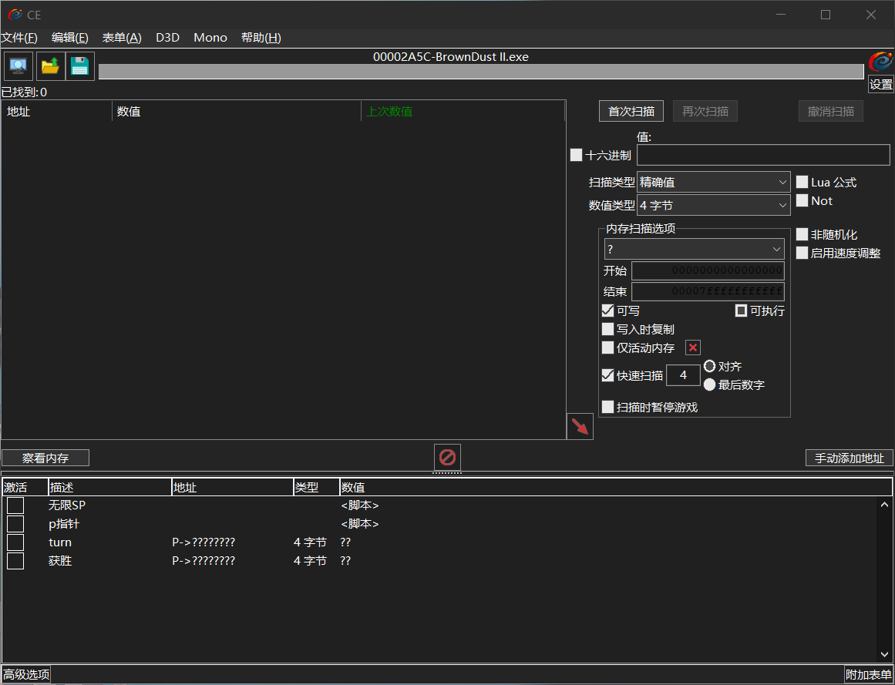
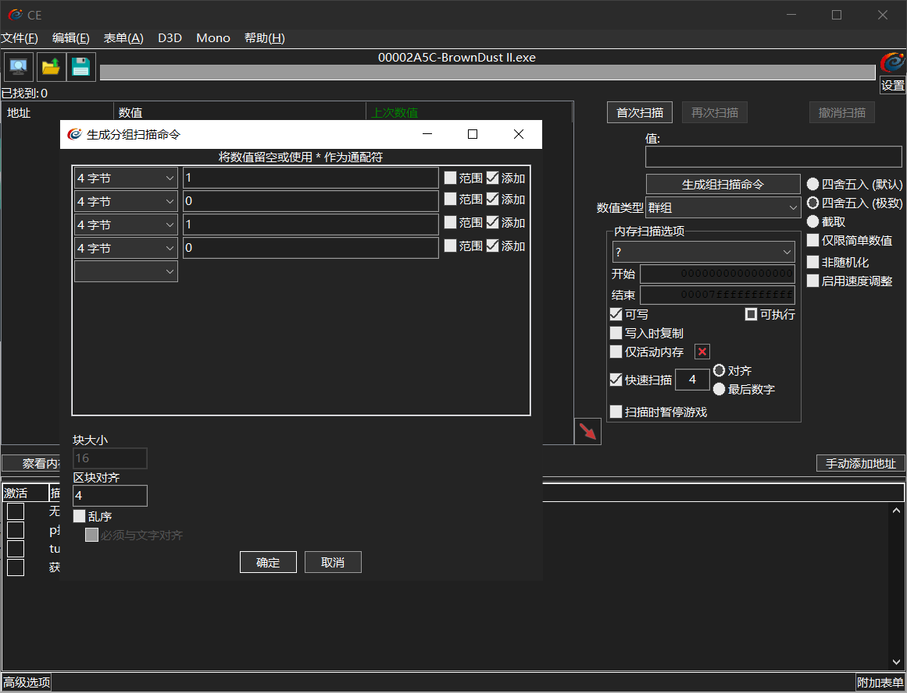
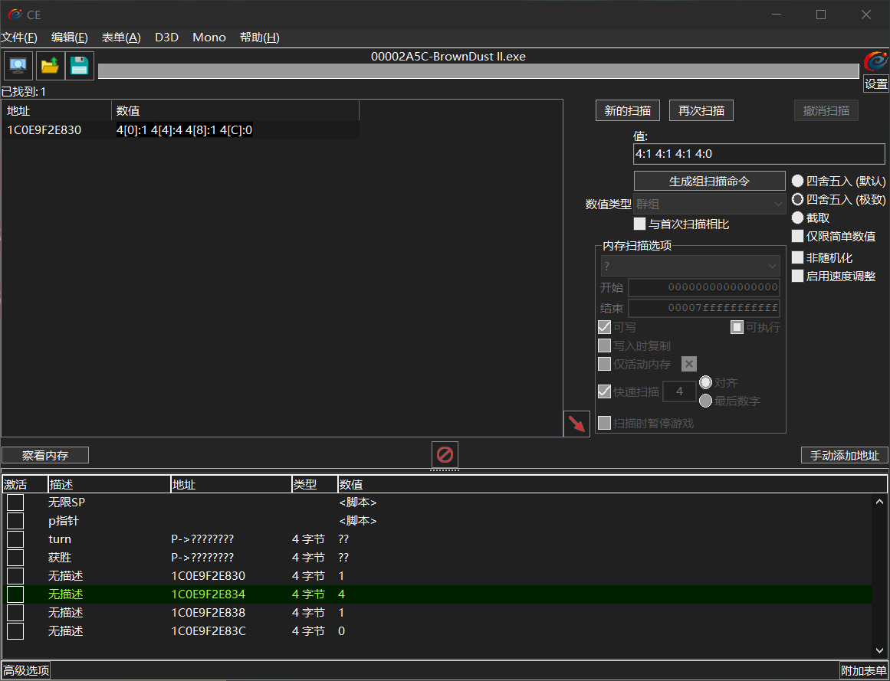
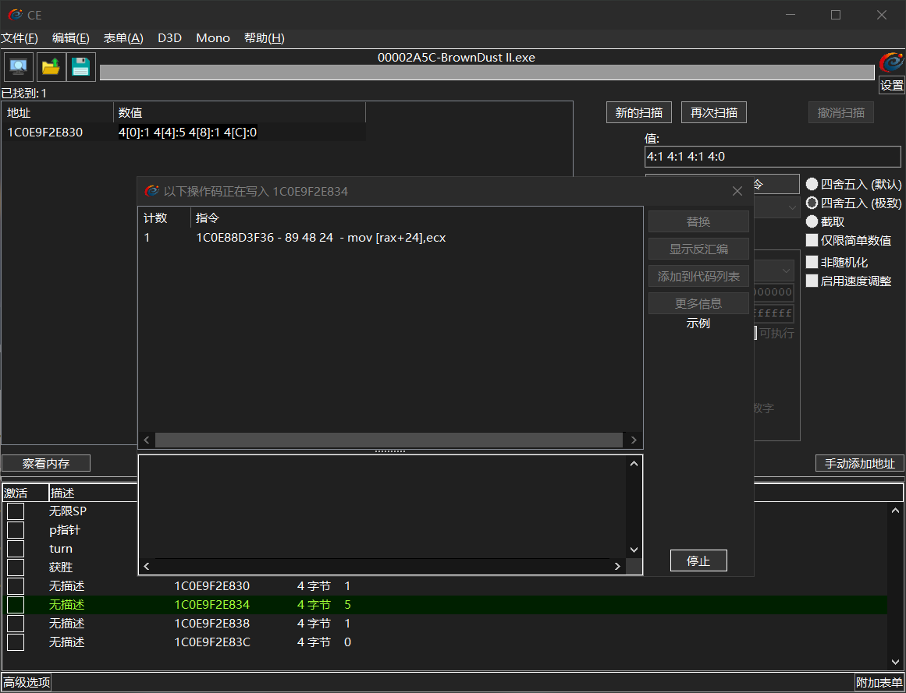
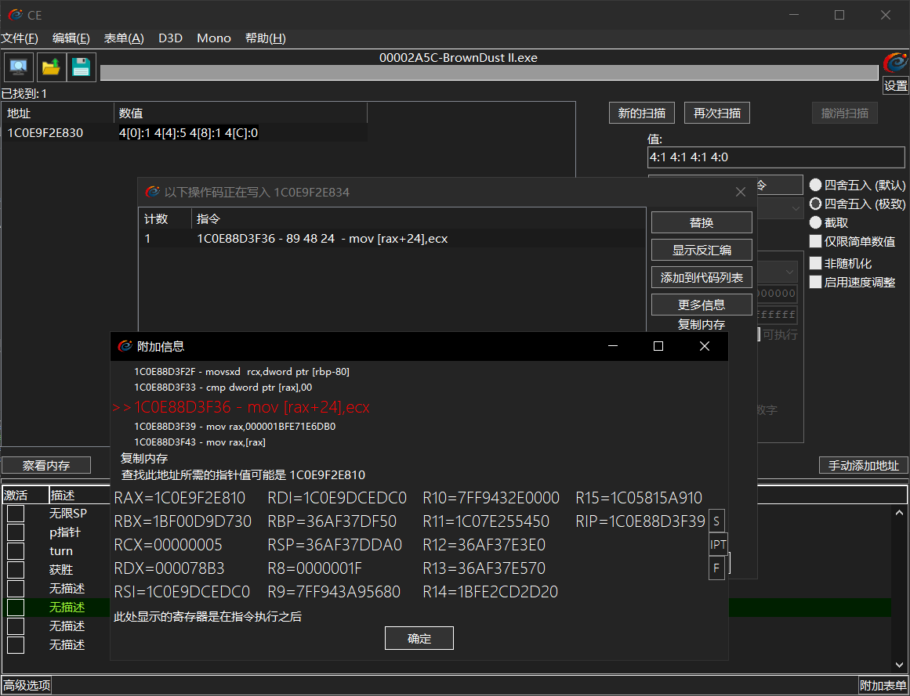
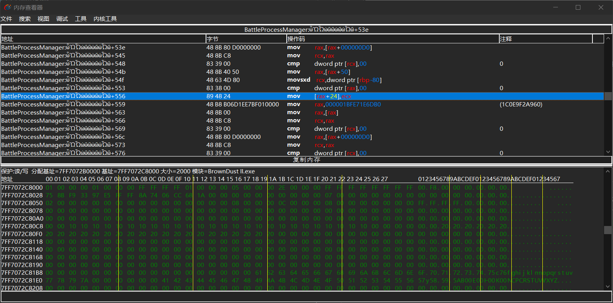
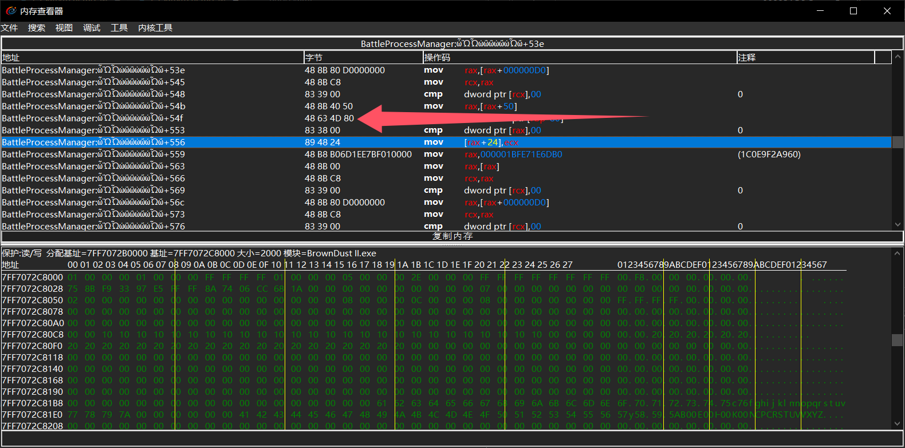
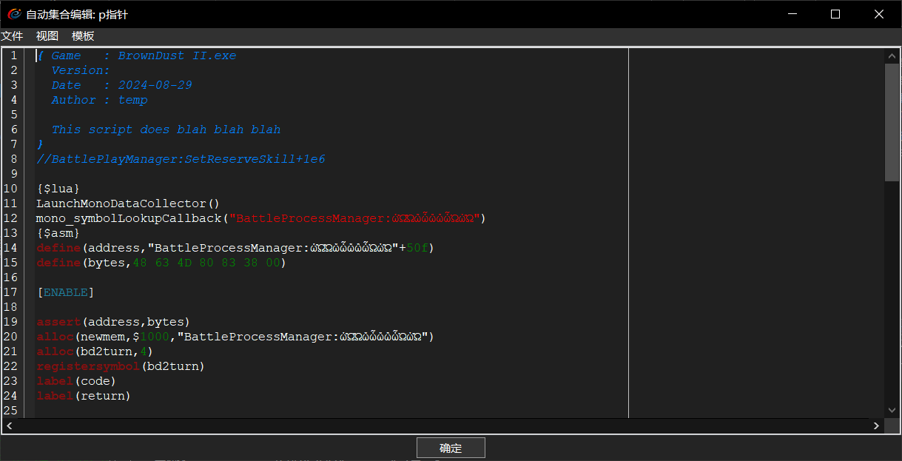
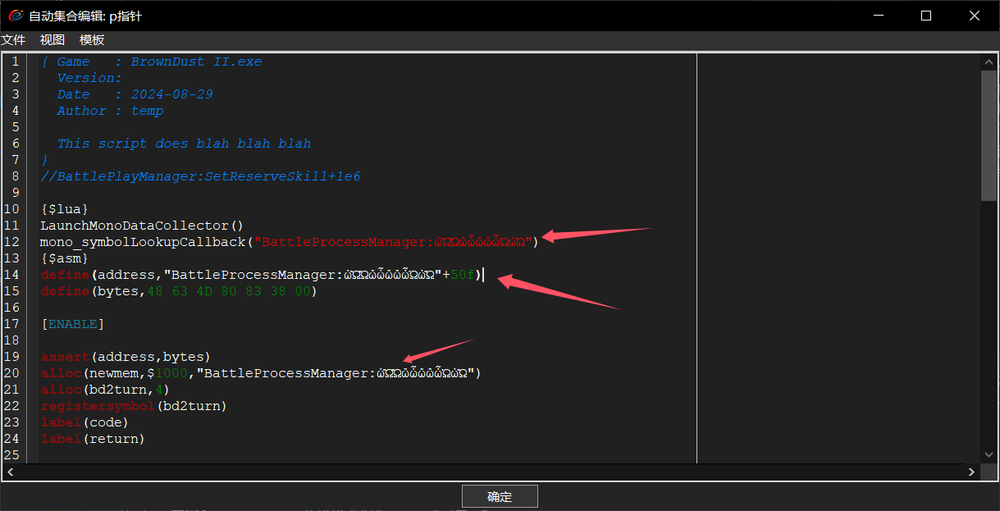
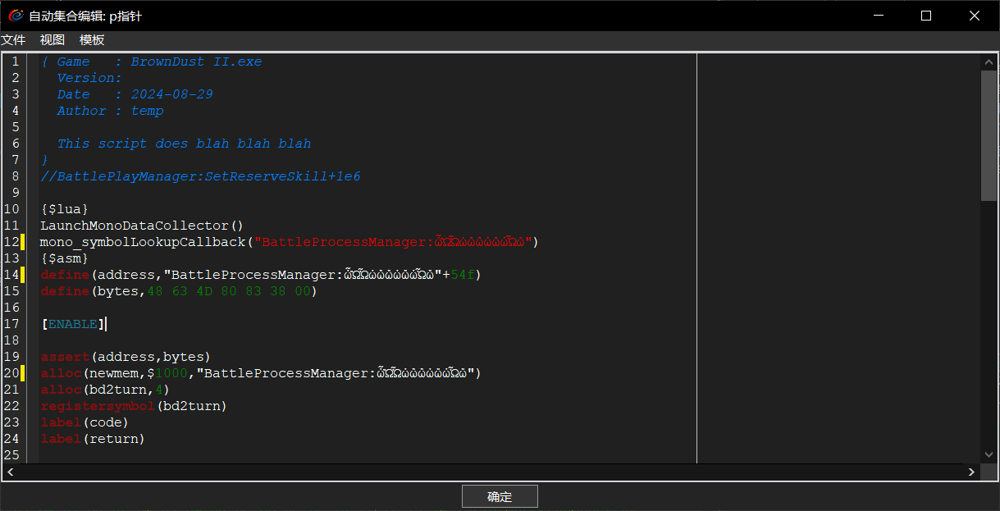

+++
date = '2024-10-18T15:35:13+08:00'
draft = false
title = 'CT表的更新'
+++

### 1.首先是打开ce选择进程导入我们过期的ct表，然后点击上面的Mono，勾选上Activate mono features

### 2.通过以前的群组方法搜索如下图：

### 3.具体操作就是开始战斗时 搜索，第一个角色行动时暂停，将第二个值改为1，重新搜索。就会找到一组数据 随着游戏一起变化的那组就是我们要的。

### 4.选中第二个表示行动角色的值，右键找出是什么写入了该值。

### 5.此时回到游戏，让角色行动一下，再返回ce，可以看到有指令去修改了这个值

### 6.双击点开这条指令，继续点击红色的指令部分，会跳转到内存查看器。

### 7.找到我箭头指向的位置右键选择仅复制地址。

### 8.例如 这次的地址为：BattleProcessManager:ὦὫὮὠὣὣὡὤὠὯὥ+54f，然后回到ce 右键选择p指针，选择更改脚本。

### 9.只需更改三个地方的值即可，如下图。改为点击确定即可。

更改后：

### 10.修改完成，勾选后即可奔放。
